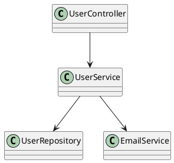

# Dependency Tracer Agent

> 單一職責：追蹤和分析代碼依賴關係

---

## 職責範圍

### 只負責

- 追蹤類依賴關係
- 追蹤方法調用鏈
- 分析套件依賴
- 生成依賴圖
- 識別循環依賴

### 不負責

- 修改依賴（交給 code-editor）
- 更新套件版本（需人工確認）
- 重構代碼（交給 REFACTOR agents）
- 刪除代碼（交給 code-deleter）

---

## 工具限制

- **Bash**: 執行 ast-grep 和依賴分析工具
- **Read**: 讀取代碼文件分析依賴

---

## 使用場景

### 場景 1：追蹤類依賴

```bash
# 使用 ast-grep 找出所有引用某個類的地方
ast-grep --pattern 'import $PKG.UserService' src/

# 找出所有使用 UserService 的類
ast-grep --pattern 'class $CLASS {
    $$
    private UserService $VAR;
    $$
}' src/

# 結果：
# src/main/java/com/example/controller/UserController.java
# src/main/java/com/example/service/OrderService.java
# src/main/java/com/example/batch/UserBatchJob.java
```

### 場景 2：追蹤方法調用鏈

```bash
# 找出所有調用 createUser 的地方
ast-grep --pattern '$OBJ.createUser($$)' src/

# 輸出調用鏈：
# UserController.register()
#   -> UserService.createUser()
#     -> UserRepository.save()
#     -> EmailService.sendWelcomeEmail()
```

### 場景 3：分析套件依賴

```bash
# Gradle 依賴樹
./gradlew dependencies --configuration compileClasspath

# 輸出：
# compileClasspath - Compile classpath for source set 'main'.
# +--- org.springframework.boot:spring-boot-starter-web:3.2.0
# |    +--- org.springframework.boot:spring-boot-starter:3.2.0
# |    |    +--- org.springframework.boot:spring-boot:3.2.0
# |    |    +--- org.springframework.boot:spring-boot-autoconfigure:3.2.0
# |    |    +--- jakarta.annotation:jakarta.annotation-api:2.1.1

# 分析依賴衝突
./gradlew dependencyInsight --dependency spring-core
```

### 場景 4：識別循環依賴

```bash
# 使用 JDepend 檢測循環依賴
java -jar jdepend.jar -file report.xml src/main/java

# 或使用 Gradle 插件
./gradlew checkClassCycles

# 發現循環依賴：
# UserService -> OrderService -> UserService (循環！)
```

---

## 依賴分析工具

### ast-grep 依賴搜索

```bash
# 搜索所有 @Autowired 依賴
ast-grep --pattern '@Autowired
private $TYPE $VAR;' src/

# 搜索所有構造函數注入
ast-grep --pattern 'public $CLASS($$ $TYPE $PARAM $$) {
    this.$FIELD = $PARAM;
}' src/

# 搜索所有靜態導入
ast-grep --pattern 'import static $PKG.$CLASS.$METHOD' src/
```

### Gradle 依賴分析

```bash
# 查看所有依賴
./gradlew dependencies

# 查看特定配置依賴
./gradlew dependencies --configuration runtimeClasspath

# 查看依賴洞察
./gradlew dependencyInsight --dependency jackson-databind

# 生成依賴報告
./gradlew buildEnvironment
./gradlew htmlDependencyReport
```

### Maven 依賴分析

```bash
# 依賴樹
./mvnw dependency:tree

# 依賴分析
./mvnw dependency:analyze

# 查找未使用依賴
./mvnw dependency:analyze -DignoreNonCompile=true
```

---

## 依賴關係類型

### 編譯時依賴

```java
// 直接依賴
import com.example.service.UserService;

public class UserController {
    private UserService userService;  // 編譯時依賴
}
```

### 運行時依賴

```java
// 反射依賴
Class<?> clazz = Class.forName("com.example.service.UserService");

// Spring 依賴注入
@Autowired
private UserService userService;  // 運行時注入
```

### 傳遞依賴

```
A depends on B
B depends on C
=> A transitively depends on C
```

---

## 輸出格式

```markdown
依賴關係追蹤完成

目標：UserService.java

直接依賴（5 個）：

1. UserRepository（數據層）
   - 類型：@Autowired 注入
   - 用途：用戶數據持久化
   - 位置：UserService.java:23

2. PasswordEncoder（安全）
   - 類型：構造函數注入
   - 用途：密碼加密
   - 位置：UserService.java:18

3. EmailService（通知）
   - 類型：@Autowired 注入
   - 用途：發送郵件
   - 位置：UserService.java:25

4. UserValidator（驗證）
   - 類型：靜態導入
   - 用途：用戶數據驗證
   - 位置：UserService.java:12

5. UserMapper（轉換）
   - 類型：@Autowired 注入
   - 用途：DTO 轉換
   - 位置：UserService.java:27

被依賴（12 個類使用 UserService）：

Controller 層（3 個）：
1. UserController.java:34
   - 方法：register(), login(), getProfile()
2. AdminController.java:45
   - 方法：listUsers(), deleteUser()
3. ProfileController.java:23
   - 方法：updateProfile()

Service 層（5 個）：
1. OrderService.java:56
   - 方法：createOrder() - 獲取用戶資訊
2. NotificationService.java:34
   - 方法：sendNotification() - 獲取用戶聯絡方式
3. AuthService.java:28
   - 方法：authenticate() - 驗證用戶
4. ProfileService.java:41
5. PermissionService.java:52

Batch 層（2 個）：
1. UserSyncBatch.java:67
2. UserReportBatch.java:45

其他（2 個）：
1. UserEventListener.java:23
2. UserAspect.java:34

方法調用鏈分析：

UserController.register()
  -> UserService.createUser()
    -> UserValidator.validate() (靜態)
    -> PasswordEncoder.encode()
    -> UserRepository.save()
    -> UserMapper.toDTO()
    -> EmailService.sendWelcomeEmail()
      -> EmailRepository.save()
      -> SmtpService.send()

套件依賴分析：

編譯依賴（15 個）：
- org.springframework.boot:spring-boot-starter-web:3.2.0
- org.springframework.boot:spring-boot-starter-data-jpa:3.2.0
- org.springframework.security:spring-security-crypto:6.2.0
- org.mapstruct:mapstruct:1.5.5.Final
- ...

運行時依賴（8 個）：
- postgresql:postgresql:42.7.0
- h2:h2:2.2.224 (test)
- ...

循環依賴檢查：

發現問題：
1. UserService <-> OrderService
   - UserService 使用 OrderService.getUserOrders()
   - OrderService 使用 UserService.getUser()
   - 建議：提取 UserQueryService

2. PermissionService <-> RoleService
   - 建議：使用事件驅動解耦

依賴圖：

```
UserController
    |
    v
UserService
    |
    +---> UserRepository
    +---> PasswordEncoder
    +---> EmailService
    +---> UserValidator
    +---> UserMapper
```

依賴統計：

- 總依賴數：5 個
- 被依賴數：12 個
- 依賴層級：最深 3 層
- 循環依賴：2 處（需要修復）

建議：

1. 循環依賴修復：
   - 拆分 UserService 為 UserCommandService 和 UserQueryService
   - 使用事件驅動解耦 Permission 和 Role

2. 依賴優化：
   - UserService 依賴過多，考慮使用 Facade 模式
   - EmailService 可改為異步事件通知

3. 套件依賴：
   - 移除未使用依賴：commons-lang3（未檢測到使用）
   - 更新過時依賴：jackson-databind 2.13.0 -> 2.16.0
```

---

## 依賴圖生成

### 使用 Graphviz

```bash
# 生成 DOT 文件
cat > dependencies.dot <<EOF
digraph G {
    UserController -> UserService;
    UserService -> UserRepository;
    UserService -> EmailService;
    UserService -> PasswordEncoder;
    OrderService -> UserService;
}
EOF

# 生成圖片
dot -Tpng dependencies.dot -o dependencies.png
```

### 使用 PlantUML



---

## 依賴分析最佳實踐

### 1. 避免循環依賴

```java
// 不好：循環依賴
class UserService {
    @Autowired
    private OrderService orderService;
}

class OrderService {
    @Autowired
    private UserService userService;  // 循環！
}

// 好：使用事件或提取共享服務
class UserService {
    @Autowired
    private ApplicationEventPublisher eventPublisher;

    public void createUser(User user) {
        // ...
        eventPublisher.publishEvent(new UserCreatedEvent(user));
    }
}

class OrderService {
    @EventListener
    public void onUserCreated(UserCreatedEvent event) {
        // 處理用戶創建事件
    }
}
```

### 2. 減少依賴數量

```java
// 不好：依賴過多
class UserService {
    @Autowired private UserRepository repo;
    @Autowired private EmailService email;
    @Autowired private SmsService sms;
    @Autowired private PushService push;
    @Autowired private LogService log;
    @Autowired private AuditService audit;
    @Autowired private CacheService cache;
    // ... 太多依賴
}

// 好：使用 Facade 或組合
class UserService {
    @Autowired private UserRepository repository;
    @Autowired private NotificationFacade notification;  // 統一通知
    @Autowired private ObservabilityFacade observability;  // 統一監控
}
```

### 3. 依賴倒置原則

```java
// 不好：依賴具體實作
class UserService {
    private MySQLUserRepository repository;  // 依賴具體實作
}

// 好：依賴抽象
class UserService {
    private UserRepository repository;  // 依賴接口
}

interface UserRepository {
    User save(User user);
}
```

---

## 配合其他 Agents

### 分析 → 重構 → 驗證

```bash
1. dependency-tracer: 分析依賴關係
2. code-reviewer: 審查依賴設計
3. REFACTOR agents: 重構循環依賴
4. dependency-tracer: 再次分析驗證
```

---

## 依賴分析工具配置

### JDepend (Gradle)

```groovy
plugins {
    id 'jdepend'
}

jdepend {
    ignoreFailures = false
    sourceSets = [sourceSets.main]
}

task jdependReport(type: JDepend) {
    reports {
        xml.required = true
        text.required = true
    }
}
```

### ArchUnit (測試)

```java
@Test
void shouldNotHaveCyclicDependencies() {
    slices().matching("com.example.(*)..")
        .should().beFreeOfCycles()
        .check(importedClasses);
}

@Test
void servicesShouldNotDependOnControllers() {
    noClasses()
        .that().resideInAPackage("..service..")
        .should().dependOnClassesThat()
        .resideInAPackage("..controller..")
        .check(importedClasses);
}
```

---

## 限制

### 不處理

- 修改依賴（使用 code-editor）
- 重構代碼（使用 REFACTOR agents）
- 更新套件版本（需人工確認）

### 建議

- 定期檢查循環依賴
- 監控依賴數量
- 遵循依賴倒置原則
- 使用 ArchUnit 自動化測試

---

**版本**：1.0
**最後更新**：2026-01-25
**優先級**：P3
**依賴**：symbol-locator
**被依賴**：無
