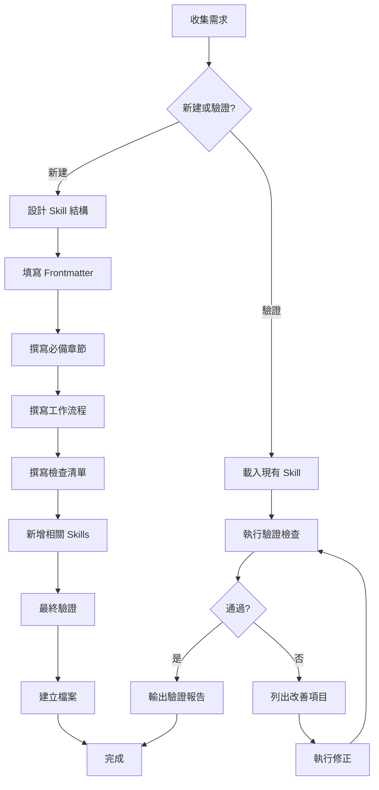

# Skill Creator

> 使用 Atomic Agents 組合建立與驗證符合 SKILL-01 標準的 Claude Code Skills
>
> 使用 Atomic Agents: file-finder + code-generator + spec-validator + compliance-auditor + pattern-checker
> 詳見 @.claude/agents/atomic/README.md

---

## 快速使用

### 建立新 Skill

```bash
# 自然語言請求
"請幫我建立一個名為 batch-processor 的 Skill，用於處理批次作業，
觸發場景包括批次轉換、批次驗證、批次報告生成"
```

主會話會自動組合 Atomic Agents 執行：
1. **收集範例** - file-finder 收集 SKILL-01 標準和現有 Skills 範例
2. **設計結構** - 主會話設計 Frontmatter 和章節大綱
3. **生成內容** - code-generator 生成 SKILL.md 內容
4. **並行驗證** - spec-validator + compliance-auditor + pattern-checker（並行）
5. **修正建立** - 根據驗證結果修正並建立檔案

### 驗證現有 Skill

```bash
# 自然語言請求
"請驗證 .claude/skills/drda-integration/SKILL.md 是否符合 SKILL-01 標準"
```

主會話會並行啟動 3 個 Atomic Agents：
- ✅ **spec-validator**: 驗證 Frontmatter 格式
- ✅ **compliance-auditor**: 驗證必備章節存在
- ✅ **pattern-checker**: 檢查命名規範和禁止內容

### 轉換功能為 Skill

```bash
# 自然語言請求
"請將 /reconcile-batch-spec-converter 封裝為可重用的 Skill"
```

主會話會：
1. 分析現有功能（讀取腳本內容）
2. 提取核心職責和觸發場景
3. 使用 code-generator 生成 SKILL.md
4. 使用 Atomic Agents 並行驗證
5. 建立完整 SKILL.md

## 核心功能

### 四大職責

1. **建立新 Skill** - 依據 SKILL-01 標準建立完整 SKILL.md
2. **驗證現有 Skill** - 檢查是否符合規範
3. **轉換功能為 Skill** - 將現有功能封裝為可重用 Skill
4. **品質審查** - 確保內容品質與一致性

### Skill 標準結構

```yaml
---
name: {skill-name}           # kebab-case，與目錄名稱一致
description: |
  {一句話摘要}
  Use this skill when:
  - {觸發場景 1}
  - {觸發場景 2}
  References: {ADR-XXX}.
allowed-tools:               # 依序：基礎 → Plugin → MCP
  - Read
  - Write
  - Edit
  - Glob
  - Grep
  - Bash
---

# {Skill Name}

> 一句話描述

## 職責
1. **職責 1** - 說明
2. **職責 2** - 說明

## 觸發時機
| 關鍵字 | 場景 |
|--------|------|
| 「XX」 | 場景說明 |

## 工作流程
1. **步驟 1** - 說明
2. **步驟 2** - 說明

## 檢查清單
- [ ] 檢查項目 1
- [ ] 檢查項目 2

## 相關 Skills
- `related-skill` - 關聯說明
```

### 工作流程

1. **file-finder**: 收集 SKILL-01 標準和現有 Skills 範例
2. **主會話**: 收集需求並設計 Skill 結構
3. **code-generator**: 生成 SKILL.md 內容
4. **spec-validator + compliance-auditor + pattern-checker**: 並行驗證
5. **主會話**: 修正並建立檔案

詳細步驟見 [guide.md](./guide.md)

## 工作流程圖



## 使用場景

| 場景 | 使用此 Skill? | 方法 |
|------|--------------|------|
| 建立新 Skill |  Yes | "請建立一個名為 XX 的 Skill..." |
| 驗證現有 Skill |  Yes | "請驗證 .claude/skills/XX/SKILL.md" |
| 轉換功能為 Skill |  Yes | "請將 XX 封裝為 Skill" |
| 改善 Skill 品質 |  Yes | "請優化 XX Skill" |
| 執行現有 Skill |  No | 直接呼叫該 Skill |
| 修改 Skill 業務邏輯 |  No | 使用對應的開發 Skill |

## 驗證檢查清單

### Frontmatter 驗證

- [ ] 包含 `name`、`description`、`allowed-tools`
- [ ] `name` 使用 kebab-case
- [ ] `name` 與目錄名稱一致
- [ ] `description` 包含 `Use this skill when:` 段落
- [ ] `description` 包含 `References:` 參考文檔
- [ ] `allowed-tools` 依序列出：基礎 → Plugin → MCP
- [ ] **無** `version`、`last_updated` 等版本欄位

### 內容結構驗證

- [ ] 有「職責」章節，列出核心職責（3-5 項）
- [ ] 有「觸發時機」章節，包含表格或清單
- [ ] 有「工作流程」章節，包含 Mermaid 圖
- [ ] 有「檢查清單」章節，使用 `- [ ]` 格式
- [ ] 有「相關 Skills」章節，列出關聯 Skills

### 內容品質驗證

- [ ] 使用客觀陳述，**無**推銷性詞彙
- [ ] **無**統計數字（成功率、使用率、效能提升 XX%）
- [ ] **無**版本歷史或變更記錄
- [ ] **無**「優勢」「特點」章節
- [ ] emoji 使用適度（只在主要章節標題）

### 工具驗證

- [ ] 所有列出的工具確實存在
- [ ] 基礎工具完整（Read, Write, Edit, Glob, Grep, Bash）
- [ ] Plugin 工具格式正確（如適用）
- [ ] MCP 工具格式正確（如適用）

## 禁止內容

| 類型 | 禁止範例 | 正確做法 |
|------|---------|---------|
| **版本資訊** | `version: 2.0`, `last_updated: 2026-01-20` | 使用 Git 歷史 |
| **推銷詞彙** | 最佳、完美、強烈推薦、市場領先 | 客觀描述功能 |
| **統計數字** | 使用率 95%、效能提升 50% | 描述實際效果 |
| **不當章節** | 「優勢」「特點」「vs 其他」「變更歷史」 | 使用標準章節 |
| **過度 emoji** | 🎊✨💯 | 只在主標題使用 |

## 常用工具清單

### 基礎工具（幾乎所有 Skill 需要）

```yaml
allowed-tools:
  - Read
  - Write
  - Edit
  - Glob
  - Grep
  - Bash
```

### Context7 MCP 工具（查詢最新文檔）

```yaml
  - mcp__context7__resolve-library-id
  - mcp__context7__query-docs
```

### Task/Agent 工具（協調工作）

```yaml
  - Task
  - TaskOutput
  - AskUserQuestion
```

## 檔案位置（ARCH-01）

```
.claude/skills/
├── {skill-name}/
│   ├── SKILL.md              # 必要：Skill 定義
│   ├── guide.md              # 可選：詳細說明
│   ├── README.md             # 可選：使用指南
│   └── scripts/              # 可選：輔助腳本
│       └── *.sh
```

## 相關規範

- **現有 Skills**: `.claude/skills/*/SKILL.md`（範例參考）


## 最佳實踐

### 推薦

1. **參考現有** - 建立新 Skill 前參考現有優秀範例
2. **清晰命名** - 使用 kebab-case，名稱語義明確

### 避免

1. **推銷詞彙** - 避免使用「最佳」「完美」等詞彙
2. **版本欄位** - Frontmatter 不應包含版本資訊

## 相關 Skills

### 協作 Skills
- `governance-checker` - 檢查 Skills 設計是否符合治理原則
- `/review-code` - 程式碼層級的規範檢查

## 詳細說明

完整流程、範本、檢查清單請參閱：[guide.md](./guide.md)
